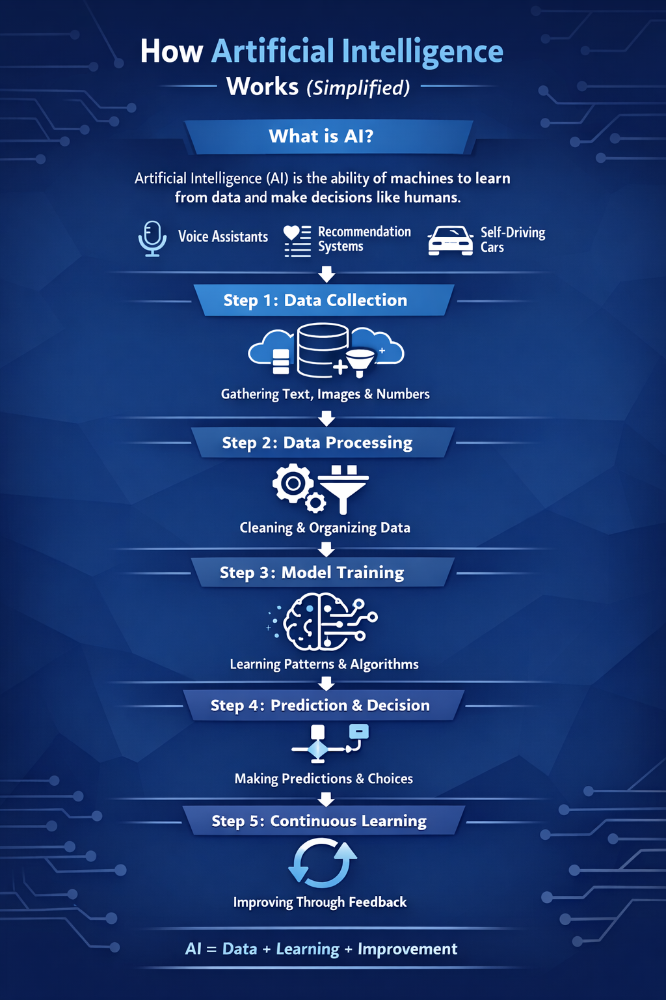

  

<h1 align="center">Hi 👋, I'm Samyak</h1>
<h3 align="center">Aspiring Software Developer | Full Stack | AI Enthusiast</h3>

## 🚀 About Me
- 🎓 Student passionate about building real-world tech  
- 💻 Focused on **Full Stack Development + AI**  
- 🧠 Strong interest in **DSA & Problem Solving**  
- ⚡ Building scalable and impactful projects  

---

<h2>🚀 Tech Stack</h2>

<table align="center">
<tr>
<th>Languages</th>
<th>Frontend</th>
<th>Backend</th>
<th>Database</th>
<th>Tools</th>
</tr>

<tr>
<td align="center">
   
   
   
   
   
  
</td>

<td align="center">
   
   
   
   
   
  
</td>

<td align="center">
   
   
   
  
</td>

<td align="center">
   
   
   
  
</td>

<td align="center">
   
   
   
  
</td>
</tr>
</table>

---

## 🐍 Contribution Snake

  

---

## 🚀 Featured Projects

### 🗳️ Smart Voting System
- Secure voting platform with OTP authentication  
- Admin dashboard with fraud detection logic  
- Focus on scalability and security  
**Tech:** React • Node.js • MongoDB  

---

### 🤖 AI Chatbot
- Generates structured outputs using advanced prompting  
- Implements few-shot & chain-of-thought techniques  
- Designed for automation pipelines  
🔗 LIVE: https://aichatbot-pink-seven.vercel.app/

---

### 🚑 CURA: Hospital Resource Provider
- Live bed & oxygen availability  
- Booking system with scalability focus  
- AI-powered medical chatbot  
🔗 LIVE: https://samyak0002.pythonanywhere.com/core/login/

---

## 🤖 LLM & Prompt Engineering

### 🧠 What I Work With
- Transformer-based models for reasoning & automation  
- Applications in summarization, chatbots & code generation  

### ⚙️ Techniques
- Role-based prompting  
- Few-shot prompting  
- Chain-of-thought reasoning  
- Structured outputs (JSON / tables)  

### 🚀 Applications
- Built prompt-based structured output systems  
- Designed reusable prompt workflows  

---

## 📈 GitHub Stats

  
  

  

---

## 🎨 Infographics

  
  

---

## 📈 What I'm Currently Doing
- 🚀 Building full-stack applications  
- 🧠 Practicing DSA consistently  
- 🤖 Exploring AI & LLM-based systems  

---

## 📫 Connect With Me
- LinkedIn: https://www.linkedin.com/in/samyak-jain-08129024a  
- Email: 2300300100151@ipec.org.in  

---

⭐️ From [samyak000](https://github.com/samyak000)
